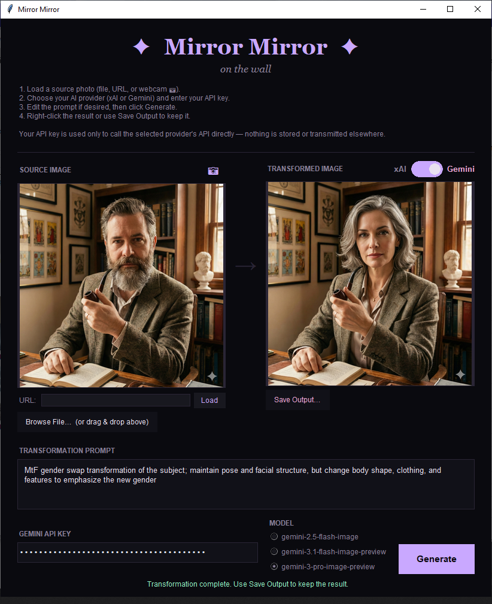

# tg_mirror

## Introduction
This is the tg_mirror, a tool written to help my friends in the LGBTQ+ community that uses AI to "look through the mirror" and see an alternate version of themselves.

## Installation Instructions
To get started with tg_mirror, follow these simple steps:
  - download mirror-mirror.py
  - pip install xai-sdk pillow tkinterdnd2
  - python mirror-mirror.py

## Transparency and xAI
My goal was to allow the user to have total ownership and privacy with their photos and API key while still allowing you to easily get the results you're looking for. Grok Imagine is, unfortunately, the only AI image editor that seems to provide consistent capabilities with this kind of gender transformation prompt. You don't have to trust me with your data, but you do have to trust xAI/Elon Musk and you might not trust them as much as I do. I have not looked into how your data will be used once it is delivered to xAI, but if you don't feel comfortable using them for this purpose, you should not proceed. I will eventually try to make a version of this tool that uses other AI providers and (hopefully eventually) a self-hosted Stable Diffusion version.

## Usage Notes:
  * You will need an xAI API key from console.x.ai — new accounts might get some free credits and pricing is generally between $0.05 and $0.17 / photo
  * grok-imagine-image-pro gives better results but takes longer (30–60s is normal) and is more expensive
  * The prompt is fully editable — you can customize it for FtM, style changes, or anything else the model supports
    * In testing, I was able to tweak the prompt to perform animal transformations as well as gender transformations
  * Your key and photo never leave your machine except to go directly to xAI
  * Make sure you click "Save Output..." to save the generated file. This is a 'one and done' tool.
