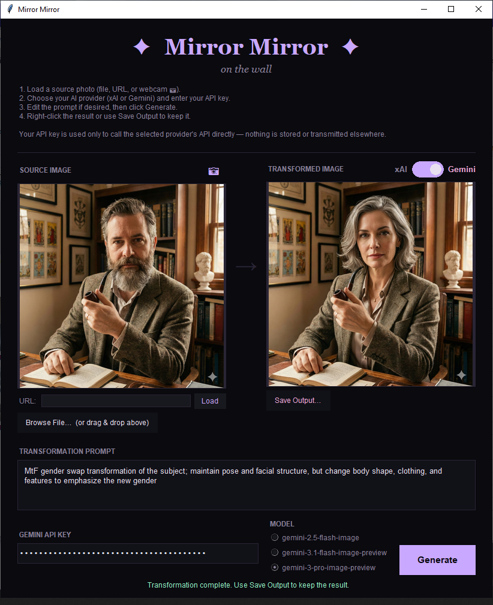

# tg_mirror

## Introduction
This is the tg_mirror, a tool written to help my friends in the LGBTQ+ community that uses AI to "look through the mirror" and see an alternate version of themselves.

## Installation Instructions
To get started with tg_mirror, follow these simple steps:
  - download mirror-mirror.py
  - pip install pillow tk tkinterdnd2 google-genai xai-sdk opencv-python
  - Might also need to: apt install python3-tk python3-pil python3-pil.imagetk
  - python mirror-mirror.py

## Transparency and xAI
My goal was to give the user as much privacy and ownership of their photos and API key as practical while still allowing them to see themselves in a new way. Grok Imagine and Gemini 3 are the best AI image editors to easily perform this kind of gender transformation with a simple prompt. Although you don't have to trust me with your data, you do have to trust xAI/Elon Musk and/or Google/Alphabet. Grok's API data FAQ is <a href="https://docs.x.ai/developers/faq/security">at this link</a>, and they say they do not use this input for model training and remove it after 30 days. This is better than using Grok's website or mobile apps. I assume Google's API terms are roughly similar but I have not found that information at the time of this writing. If you ever don't feel comfortable using those services, you should not proceed. I will eventually try to make a version of this tool that uses a self-hosted version but I'm not there yet.

## Model Choices
gemini-3.1-flash ⭐ (fast, faithful)
gemini-3-pro (detailed, slow)
gemini-2.5-flash (fastest, cheapest, stylized)
grok-imagine-image-pro	(medium detail, medium speed)
grok-imagine-image (fastest, stylized)

## Usage Notes:
  * You will need an xAI API key from <a href="https://console.x.ai/">console.x.ai</a> and/or a Google API key from <a href="https://aistudio.google.com/api-keys">aistudio.google.com</a> — new accounts might get some free credits and <a href="https://docs.x.ai/developers/models">pricing</a> is <a href="https://ai.google.dev/gemini-api/docs/pricing">generally</a> between $0.05 and $0.17 / generation
  * See model information above; better models generally give better results but take longer (30–60s is normal) and is more expensive
  * The prompt is fully editable — you can customize it for FtM, style changes, or anything else the model supports
    * In testing, I was able to tweak the prompt to perform animal transformations as well as couple's gender transformations
    * Grok seems to be better at those tweaked prompts than Gemini
  * Your key and photo never leave your machine except to go directly to the AI provider
  * Make sure you click "Save Output..." to save the generated file. This is a 'one and done' tool.

## New in Version 2
📷 Webcam capture support
🔁 Toggle between xAI Grok and Google Gemini
🧠 Three Gemini models to choose from (2.5-flash, 3.1-flash default, 3-pro)
🖼️ Drag & drop + URL + file loading
🔒 API keys never stored to disk

## ⚠️ Disclaimer
  * This is "Bring Your Own Key" software that runs locally for a user. No data is sent to the developer and the end user is solely responsible for the content they generate using their personal API key.
  * The end user should be mindful of xAI and Google's Acceptable Use Policy.
  * This software is vibe coded with love, but provided "as is," without warranty of any kind.
  * This software is not a mental health tool. If you are in crisis, call <a href="tel:911">911</a> or seek help from a place like <a href="https://trans-care.org/support/">Trans-Care.org</a>.
